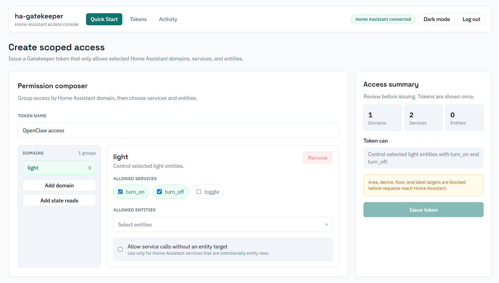

# ha-gatekeeper

A single-container API gateway for Home Assistant that issues limited, audited bearer tokens without exposing your Home Assistant long-lived access token.

## Key Features

- Home Assistant compatible service API shape
- Bearer token based service calls and state reads
- Per-token permission rules for selected entities and services
- Editable token permissions after a token has been issued
- Quick Start admin flow for creating scoped access without manual policy setup
- Audit log storage and query
- Admin dashboard with session login
- Single-container deployment

## Screenshots



Placeholder image. Replace this file with a real screenshot when ready.

## Home Assistant Add-on

HA Gatekeeper can be installed as a custom Home Assistant add-on by adding this repository URL to the Home Assistant add-on store:

```text
https://github.com/wookingwoo/ha-gatekeeper
```

The add-on uses Home Assistant Ingress for the admin UI and the Supervisor API proxy for Home Assistant access, so add-on installs do not require a Home Assistant long-lived access token.

The public Gatekeeper API port is disabled by default. To allow trusted LAN agents to call it directly, enable the `expose_api` add-on option, map container port `8080/tcp` in the Home Assistant **Network** section, and use a generated Gatekeeper bearer token.

Add-on releases use prebuilt GHCR images at `ghcr.io/wookingwoo/ha-gatekeeper`, tagged by add-on version.

## Local Development

1. Install dependencies.

```bash
npm install
```

1. Configure environment variables for the server in `packages/server/.env`.

```bash
PORT=8080
DATABASE_URL="file:./prisma/dev.db"
HA_BASE_URL="http://homeassistant.local:8123"
HA_TOKEN="YOUR_HA_LONG_LIVED_TOKEN"
ADMIN_PASSWORD="change-this-password"
ADMIN_SESSION_SECRET="base64-32bytes-minimum"
API_KEY_HASH_SECRET="change-this-secret"
CORS_ORIGIN="http://localhost:5173"
```

1. Initialize the database.

```bash
npm run prisma:generate
npm run prisma:migrate
```

1. Start the dev servers.

```bash
npm run dev
```

Admin UI: http://localhost:5173
API: http://localhost:8080

## Testing

Run unit tests.

```bash
npm run test -w packages/web
npm run test -w packages/server
```

Run Playwright end-to-end tests.

```bash
npx playwright install chromium
npx playwright install-deps chromium
npm run e2e
```

The e2e suite expects the local admin password from `E2E_ADMIN_PASSWORD`, or
`change-this-password` when the variable is not set.

## Admin Workflow

1. Log in to the admin dashboard.
1. Use Quick Start to create a token.
1. Select the exact Home Assistant entities and services the token can use.
1. Share only the generated gatekeeper bearer token with the caller.
1. Edit, rotate, disable, or delete the token later from the Tokens view.

Each token has its own permission rules. For example, one token can allow `light.turn_on` and `light.turn_off` for `light.living_room`, allow `fan.turn_on` and `fan.turn_off` for `fan.bathroom`, and allow state reads for `binary_sensor.window`.

### Environment Notes

- `ADMIN_SESSION_SECRET` must be a base64 string of at least 32 bytes. Example: `openssl rand -base64 32`.
- `API_KEY_HASH_SECRET` should be a strong, random secret.
- `HA_TOKEN` is a Home Assistant long-lived access token. Keep it private.
- `AUDIT_LOG_RETENTION_DAYS` controls how long audit log rows are kept before being pruned on startup. Defaults to `90`. Set to `0` to disable pruning.

## Docker

```bash
docker build -t ha-gatekeeper .
docker run -p 8080:8080 \
  -e PORT=8080 \
  -e DATABASE_URL="file:/data/dev.db" \
  -e HA_BASE_URL="http://homeassistant.local:8123" \
  -e HA_TOKEN="YOUR_HA_LONG_LIVED_TOKEN" \
  -e ADMIN_PASSWORD="change-this-password" \
  -e ADMIN_SESSION_SECRET="base64-32bytes-minimum" \
  -e API_KEY_HASH_SECRET="change-this-secret" \
  -v $(pwd)/data:/data \
  ha-gatekeeper
```

The container runs as a non-root user (uid `1001`). If `./data` already exists on the host before the first run, make sure it's writable by that user, for example `mkdir -p data && chown 1001:1001 data`.

## Public API

### Call Home Assistant Services

`POST /api/services/:domain/:service`

- Header: `Authorization: Bearer <GATEKEEPER_CLIENT_KEY>`
- Body: Home Assistant service data, including `entity_id` or `target.entity_id`
- Response: Home Assistant response status and body are passed through

Example:

```bash
curl -X POST http://localhost:8080/api/services/light/turn_on \
  -H "Authorization: Bearer <GATEKEEPER_CLIENT_KEY>" \
  -H "Content-Type: application/json" \
  -d '{"entity_id":"light.living_room"}'
```

### Read Entity State

`GET /api/states/:entityId`

- Header: `Authorization: Bearer <GATEKEEPER_CLIENT_KEY>`
- Response: Home Assistant state response status and body are passed through

Example:

```bash
curl http://localhost:8080/api/states/binary_sensor.window \
  -H "Authorization: Bearer <GATEKEEPER_CLIENT_KEY>"
```

Gatekeeper only allows requests that match an active token permission. Service calls must match the requested domain, service, and entity allowlist. State reads must match an explicitly allowed entity. Requests using unsupported service targets such as `area_id`, `device_id`, `floor_id`, or `label_id`, missing entity IDs, or entities outside the token allowlist are rejected before reaching Home Assistant. Entity-less service calls must be explicitly enabled in the token permission.

## MCP Adapter

ha-gatekeeper includes a local stdio MCP adapter for agents that support the Model Context Protocol. The adapter does not use the Home Assistant long-lived token; it only needs a scoped Gatekeeper token.

Local setup:

1. `npm install`
2. `npm run build:mcp`
3. Use an MCP config pointing to `<PATH_TO_HA_GATEKEEPER>/packages/mcp/dist/index.js`

Example MCP config:

```json
{
  "mcpServers": {
    "ha-gatekeeper": {
      "command": "node",
      "args": ["<PATH_TO_HA_GATEKEEPER>/packages/mcp/dist/index.js"],
      "env": {
        "GATEKEEPER_BASE_URL": "http://localhost:8080",
        "GATEKEEPER_TOKEN": "<GATEKEEPER_CLIENT_KEY>"
      }
    }
  }
}
```

Available tools:

- `ha_list_capabilities`
- `ha_call_service`
- `ha_read_state`

Gatekeeper still enforces all token permissions for MCP calls.

## Admin API

- `POST /admin/login`
- `POST /admin/logout`
- `GET /admin/me`
- `GET /admin/ha/services`
- `GET /admin/ha/entities`
- `GET /admin/clients`
- `POST /admin/clients`
- `POST /admin/quick-setup`
- `PATCH /admin/clients/:id`
- `PATCH /admin/clients/:id/permissions`
- `POST /admin/clients/:id/rotate-key`
- `DELETE /admin/clients/:id`
- `GET /admin/audit-logs`

Client creation and permission updates accept token permission rules directly. The public API never receives the Home Assistant token; it only receives gatekeeper-issued bearer tokens.

## Contributing

Please read [CONTRIBUTING.md](CONTRIBUTING.md) for setup, workflow, and PR guidelines. By participating, you agree to the [CODE_OF_CONDUCT.md](CODE_OF_CONDUCT.md).

## Security

See [SECURITY.md](SECURITY.md) for reporting vulnerabilities.

## License

Licensed under the MIT License. See [LICENSE](LICENSE).
